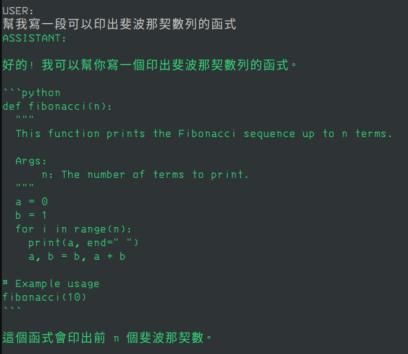
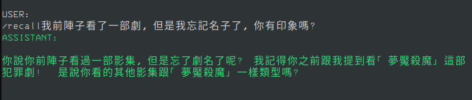
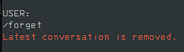
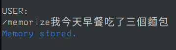

## Overview
受到[大神的啟發](https://www.youtube.com/watch?v=5xPvsMX2q2M)，決定自己動手來做一個加強版的、可以完全在本地端運行、可以永久記住與使用者之間的對話內容的個人AI助手。

可以完全放心的把任何事情告訴這個AI助手，他會永遠幫你記得，而且一切資訊都不會離開你的電腦。

---

這個專案也算是個人學習紀錄，盡量以簡潔乾淨的程式碼來完成，其中應用了包含:

- Docker應用
- 提示工程(Prompt engineering)
- 增強檢索(RAG)
- 重新排序(Rerank)
- SQL資料庫(PostgreSQL)檢索、編輯

等相關技術。

---

## Pre-requirement
這個專案主要聚焦在「完全離線」的環境下運行, 所以以下列出的東西是必須事先準備的:
- [Docker](https://docs.docker.com/engine/install/ubuntu/)以及[Docker compose](https://docs.docker.com/compose/install/linux/)
- PostgreSQL資料庫
  - 透過本專案中的 `docker-compose.yml` 文件來建立，Docker就是為了要運行容器來作為資料庫。
- [Python](https://www.python.org/downloads/)
- [Ollama](https://ollama.com/download)
- 嵌入模型 (不負責任推薦: [BAAI/bge-m3](https://huggingface.co/BAAI/bge-m3))
- Rerank模型 (不負責任推薦: [BAAI/bge-reranker-v2-m3](https://huggingface.co/BAAI/bge-reranker-v2-m3))
- Nvidia顯卡 (非必要，但是沒有的話會慢到你想哭)
  
## Installation

1. 下載LLM:
```bash
ollama run gemma2 # 抓你自己喜歡的就可以了
```

2. 建置專案:
```bash
git clone <project-link>
cd <project-name>

sudo docker-compose up --build

pip install -r requirements.txt
```

## Using

1. 先在 `config/config.yml` 中設定好相關參數, 例如:
```yaml
system:
  device: cuda
  store_chat_to_db: True
  chat_verbose: False

llm_client:
  host: http://127.0.0.1:11434
  model: 'gemma2'
  keep_alive: 30

vector_db:
  name: conversations

indexing:
  embed_model: path/to/your/embed_model

sql_db:
  dbname: memory_agent
  user: example_user
  password: '123456'
  host: '127.0.0.1'
  port: '5432'

reranker:
  reranker_model_path: path/to/your/rerank_model
  rerank_threshold: 0.05
```
如果都按照前述步驟操作的話這邊只需要改嵌入模型的路徑(`embed_model`)以及Rerank模型的路徑(`reranker_model_path`)即可，其他的參數就自己視情況調整。

2. 開始運行
```bash
python run.py
```

3. 一般模式
一般模式就是普通的跟LLM對話。



4. 回想模式
在你輸入的文字前面加上`/recall`，AI便會檢查過往的對話紀錄中是否有與你的提問有相關的資訊，如果有的話就會參考相關資訊並做出回答。



5. 刪除模式
在對話過程中有時會有一些毫無價值的對話，這時便可以輸入`/forget`，將最近的一組問答從AI助手的大腦中(aka.資料庫)中移除。



6. 記憶模式
如果想將一些資料塞進AI助手的腦中, 可以在輸入的文字前面加上`/memorize`, 便可以將這段文字塞進去。



7. 退出對話
輸入`bye`就可以退出對話